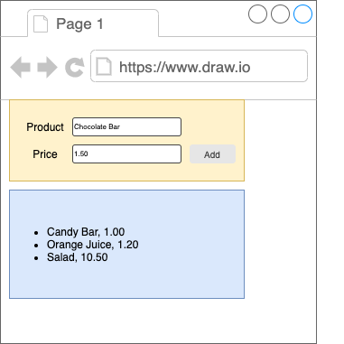

# Form and List: Assignment

## Brief

Consider the following UI:

You are to apply form submission on the yellow section. Each form submission through the "Add" button should push an object into an array which populates the list in the blue section.

Hint:
- You need two states: one for form submission, one for populating the list.

No code base is given in this assignment. Use `npx create-react-app <your app name>` to generate a react app.

## Submission Guidelines

- Cite any relevant sources consulted during your research
- Solve the problems using your own code
- Do not copy and paste solutions from the source material
- Submit your assignment to black board.